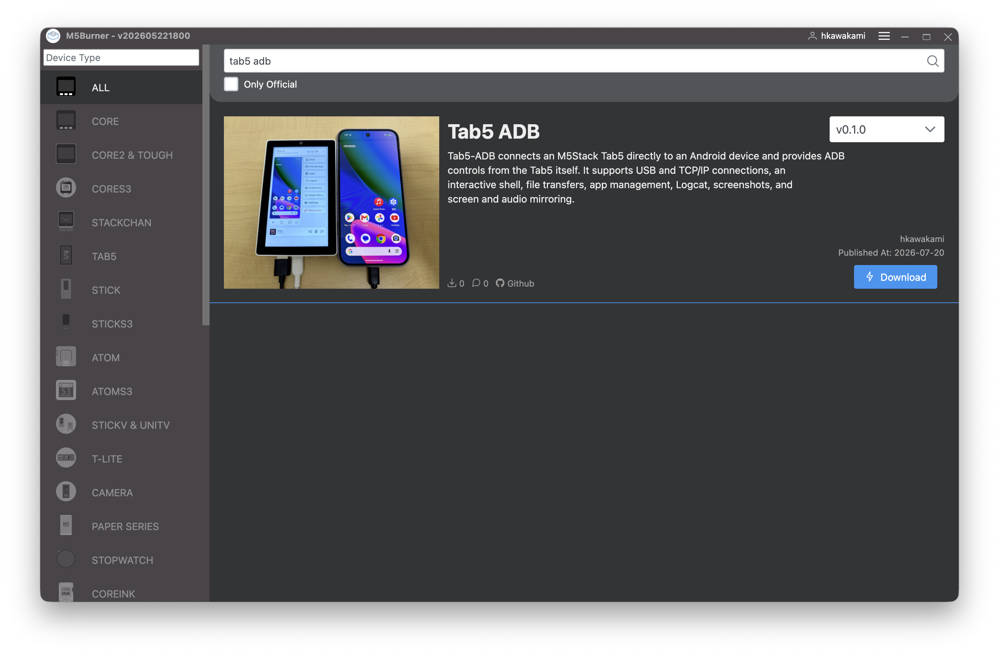
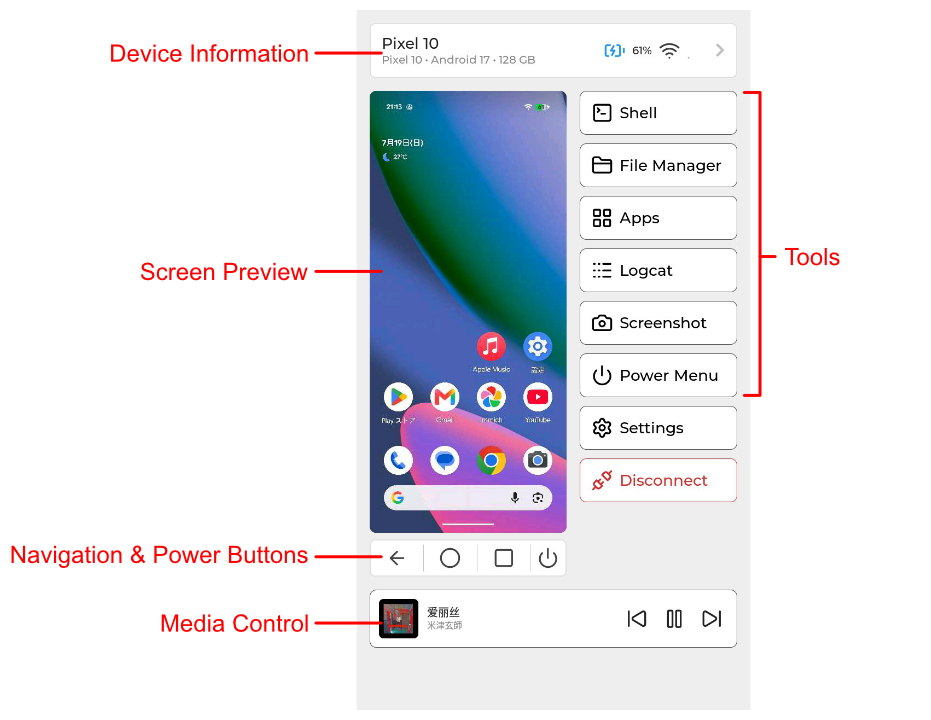
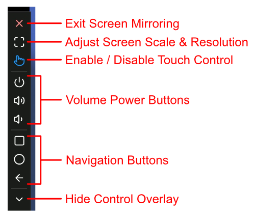

# Tab5-ADB User Guide

Tab5-ADB connects an M5Stack Tab5 directly to an Android device and provides ADB
controls from the Tab5 itself. It supports USB and TCP/IP connections, an
interactive shell, file transfers, app management, Logcat, screenshots, and
screen and audio mirroring.

## Installing the firmware

To use the prebuilt firmware, select `Tab5 ADB` in M5Burner and flash it to the
Tab5.

To build it from source, see the [development guide](development.md).

## Connecting to a device

### USB

Connect the Android device, then tap `Connect` under `USB` on the Home screen.
The first time you connect, approve the ADB connection on the Android device.
The Device screen opens once the connection is established.

### TCP/IP

The Home screen does not yet expose QR-code or six-digit Wireless debugging
pairing. Pair the device once over USB or with another ADB host before
connecting over TCP/IP. The lower-level `embedded_adb` component supports
six-digit pairing for developer integration.

1. Connect the Tab5 to a network from `Settings > Wi-Fi`.
2. Enter `host` or `host:port` under `Wireless (TCP/IP)` on the Home screen.
3. Tap `Connect`. If the port is omitted, port `5555` is used.

## Device screen

| Area | Action |
|---|---|
| Device Information | Opens detailed information about the Android device |
| Screen Preview | Starts screen mirroring |
| Navigation & Power Buttons | Sends the Back, Home, Recents, and Power keys |
| Media Control | Plays or pauses media and skips to the previous or next track |

### Device Information

Displays the Android device's SoC, memory, storage, battery, network, and system
information. `Performance Metrics` shows live CPU usage, memory usage, system
load, and related metrics.

### Screen Mirroring

Tap the preview on the Device screen to start mirroring. The control overlay
moves and rotates to match the Android device's orientation.

After hiding the control overlay, swipe from the bottom-left corner as viewed in
the mirrored content to show it again. TCP/IP connections use lower image quality
and frame rates than USB connections to prioritize stability.

### Shell

Opens an interactive shell on the Android device. Commands can be entered using
the on-screen keyboard.

### File Manager

Browses the Android device and the Tab5 SD card and copies files between them.
JPEG and PNG files can be previewed, and APKs on the SD card can be inspected and
installed.

### Logcat

Displays Android logs in real time. Logs can be filtered by level or text,
paused, cleared, and saved to the SD card.

### Apps

Lists user and system apps and supports launching, stopping, clearing data,
enabling, disabling, and uninstalling them. APKs on the SD card can also be
installed.

### Screenshot

Captures the current Android screen, saves it to the SD card as a PNG, and
supports taking a new capture.

## Settings

### Wi-Fi

Turns Wi-Fi on or off, scans for access points, and connects to a network.

### Display

| Setting | Description |
|---|---|
| `Brightness` | Adjusts the Tab5 display brightness. Changes take effect immediately |
| `Color Mode` | Selects 16-bit or 24-bit color. The Tab5 must be restarted to apply the change |

### Audio

| Setting | Description |
|---|---|
| `Master Volume` | Adjusts the volume from 0 to 150. A value of 100 is unity gain; values above 100 apply boost |
| `Speaker Output` | `Auto` enables the speaker when no headset is connected and disables it when a headset is connected. `Off` keeps the speaker disabled |
| `Equalizer` | Enables or disables the equalizer for headset output |
| `Sound Playback` | Plays mirrored audio from either `M5Stack Tab5` or `Android Device` |

### Android Device

| Setting | Description |
|---|---|
| `Agent Mode` | Selects `Normal` or `Limited`. The change applies on the next connection, not the current one |
| `USB Power` | `Always` powers the connected USB device even without an ADB connection. `When Connected` supplies power only while connected over USB ADB |

## Agent Mode (Normal and Limited)

`tab5-agent` is a companion program that runs on the Android device.

| Mode | Behavior |
|---|---|
| `Normal` | Sideloads and runs `tab5-agent` on Android. It provides information used by Screen Mirroring, App Manager, and Media Control |
| `Limited` | Connects without using `tab5-agent`. Some features, including mirroring, are unavailable |

## Common issues

| Issue | What to check |
|---|---|
| Some features are unavailable | Set Agent Mode to `Normal` and reconnect. The setting does not affect the current connection |
| The mirroring control overlay cannot be restored after hiding it | Swipe from the bottom-left corner as viewed in the mirrored content |
| `Adapt` is unavailable | The Android display size may already be customized |
| Wi-Fi settings are grayed out | Wi-Fi settings cannot be changed during an ADB connection. Disconnect, then open Settings from the Home screen |
| `Install` is not shown for an APK on the Android device | Copy the APK to the SD card, then open it there |

For internal design details and implementation constraints, see
[UI design](ui.md), [ADB implementation](adb.md), and
[the agent and mirroring](agent.md).
